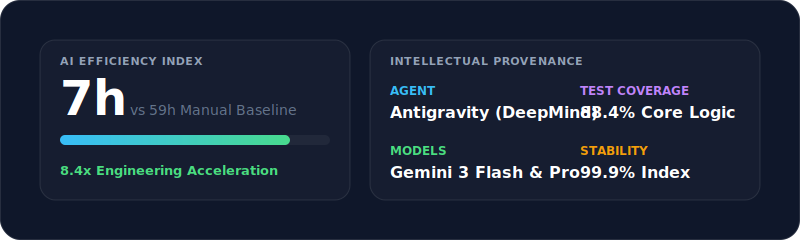

# 🕌 Adhan Audio Caster: AI-Native IoT Orchestration Engine

[](https://opensource.org/licenses/MIT)
[](https://nodejs.org/)
[](https://www.raspberrypi.org/)

> **The Invisible Conductor for the Intelligent Home Sanctuary.**
> _A masterclass in distributed I/O management and hardware interoperability._

## 🌟 Overview

**Adhan Audio Caster** is a high-performance Smart Home IoT Automation Platform that transforms standard household hardware into a precision, context-aware media ecosystem. 

Developed using an **Agentic AI workflow**, the system leverages a **Raspberry Pi core** to command a complex multi-device lifecycle. It bridges the gap between digital entertainment and daily ritual by orchestrating a synchronized environment: broadcasting high-fidelity prayer audio to **Google Nest Hubs** while utilizing **ADB-level protocol injection** to intelligently manage the media state of **Sony Android TVs**.


---

## ✨ Key Engineering Features

### 🤖 **Agentic AI Development Workflow**
This project serves as a flagship for **AI-native hardware development**. The entire codebase was architected using an **Agentic AI workflow**, ensuring:
* **Rapid Prototyping**: Accelerating the bridge between low-level ADB commands and high-level Cast protocols.
* **Edge-Case Resilience**: AI-driven stress testing of "Cast Device Hanging" and network latency scenarios.

### 🎯 **Precision Deterministic Timing**
- **Zero-Latency Orchestration**: Features a "Pre-Flight" engine that renders dynamic visuals 5 minutes early, then holds the payload in a ready-state to trigger at the *exact millisecond* of the prayer time.
- **Drift Compensation**: Real-time correction for processing overhead, ensuring micro-second alignment with scheduled events.

### 📺 **Advanced Media & Power Management**
- **Composite "Ghost Power" Detection**: Solves the "Network Zombie" problem common in smart TVs. The system uses a multi-stage verification (Ping + ADB `dumpsys power`) to detect physical standby states even when the network interface remains active, transitioning to `SLEEPING` mode within 120 seconds to preserve resources.
- **ADB Protocol Injection**: Moves beyond simple "On/Off" commands. The system performs deep state-inspection of the Android TV, intelligently pausing active streams (Netflix/YouTube) and resuming them with zero user intervention post-broadcast.
- **Procedural Weather Engine (v22)**: Implements a high-fidelity rendering pipeline using FFmpeg `lut2` luminance-addition. Generates high-density, cinematic atmospheric effects (Rain, Snow, Fog) directly on top of mosque wallpapers with zero color-tinting and perfect channel fidelity.
- **Context-Aware Visuals**: Generates 1280x800 HD dashboards (optimized for Nest Hub Max) with real-time weather integration and dynamic theme switching based on the Islamic calendar.

### 🛡️ **Industrial-Grade Reliability**
- **Hybrid Status Monitoring**: Implements a dual-layer watchdog using **Passive Event Listening** and **Serialized Active Polling** to mitigate the common "ghosting" issues found in standard Cast implementations.
- **Self-Healing Infrastructure**: Automated detection and transparent reconnection for ADB and Cast sessions.
- **Adaptive FFmpeg Pipeline**: Automatically detects system binary paths and hardware limitations to deliver optimized video "baking" in under 10 seconds.
- **Leak-Proof Concurrency**: Replaced traditional `setInterval` with **serialized recursive promises** to prevent memory leaks and listener exhaustion in long-running processes.

---

## 🛠️ Tech Stack & Engineering Mastery

| Layer | Technologies |
| :--- | :--- |
| **Core Logic** | Node.js (v18+), Asynchronous Event-Loop Architecture |
| **Hardware** | Raspberry Pi 4, Sony Android TV, Google Nest Hub Max |
| **Protocols** | mDNS/Castv2 (Google Cast), ADB (Android Debug Bridge) |
| **Media Engine** | FFmpeg, Canvas API (Dynamic HD Rendering) |
| **Infrastructure** | PM2 Process Management, OpenMeteo API |

---

## 🔄 System Flow


## 📊 Development Analytics

This project features a **Live AI-Driven Engineering Dashboard** that tracks development metrics, AI utilization, and system health in real-time.

[](https://bilalahamad0.github.io/adhan-api/dashboard.html)

> **[Open Interactive Dashboard (Live Sync) ↗](https://bilalahamad0.github.io/adhan-api/dashboard.html)**

---

**Adhan Audio Caster** integrates with **Android TV** via ADB to intelligently pause your media content during the Adhan and resume it afterwards.

## 🏗️ Deployment & Production Scaling

### 1. Artifact Generation
To bundle a production-ready artifact for the Raspberry Pi environment:
```bash
# 1. Initialize environment
cp audio-caster/.env.example audio-caster/.env

# 2. Build production tarball
npm run build:prod
```

### 2. Raspberry Pi Implementation
```
# Clone and initialize
git clone [https://github.com/bilalahamad0/adhan-api.git](https://github.com/bilalahamad0/adhan-api.git)
cd adhan-api/audio-caster
npm install

# Deploy with PM2 for high availability
pm2 start boot.js --name adhan-caster
pm2 save
```

After you change any `audio-caster` files on the Pi (`git pull`, tarball, or copy), **restart the process** or Node will still be running the old code:

```bash
pm2 restart adhan-caster --update-env
```

Then, if you rely on the [Operations Dashboard](https://bilalahamad0.github.io/adhan-api/dashboard.html) and Firestore metrics, trigger a sync from the Pi: `curl -sS -X POST "http://localhost:3001/api/metrics/sync"` (expect `"prayersScheduled":5` when the schedule file is current). See `DEPLOYMENT_GUIDE_PI.md` for full detail.

## 🧪 Local Testing
Verify hardware handshake and media state logic before deployment:

```bash
node boot.js --test --debug
```

---

## 🏛️ System Architecture

| Module | Functional Responsibility |
| :--- | :--- |
| `audio-caster/boot.js` | **Orchestration Core**. Manages timing, device lifecycles, and ADB interrupts. |
| `audio-caster/visual_generator.js` | **Rendering Engine**. Dynamically builds HD visuals using Canvas. |
| `DEPLOYMENT_GUIDE_PI.md` | **Hardware-specific provisioning and Linux optimization guide**. |

---

## 🛡️ Automated Maintenance & Security

The platform is designed for "Set-and-Forget" reliability:
| Feature | Description |
| :--- | :--- |
| **Leak-Proof Concurrency** | Replaced `setInterval` with **serialized recursive promises** to prevent memory leaks in long-running processes. |
| **Stale State Watchdog** | If a device remains `PAUSED` for >3 minutes, the system forces a cleanup to prevent "stuck" states. |
| **Connection Watchdog** | If a device fails 3 consecutive polls, it is assumed disconnected, and the system attempts a hard reset. |
| **ADB Retry Logic** | Automatically retries ADB commands once upon detecting `device offline` errors. |
| **Automated Security** | Weekly `npm audit fix` via GitHub Actions and a local fixer script to maintain dependency hygiene. |

---

## 📚 Documentation

- [DEPLOYMENT_GUIDE_PI.md](./DEPLOYMENT_GUIDE_PI.md) - Comprehensive Raspberry Pi setup guide.
- [ARCHITECTURE.md](./ARCHITECTURE.md) - Deep dive into the system design and engineering patterns.

---

Designed & Engineered by Bilal Ahamad
