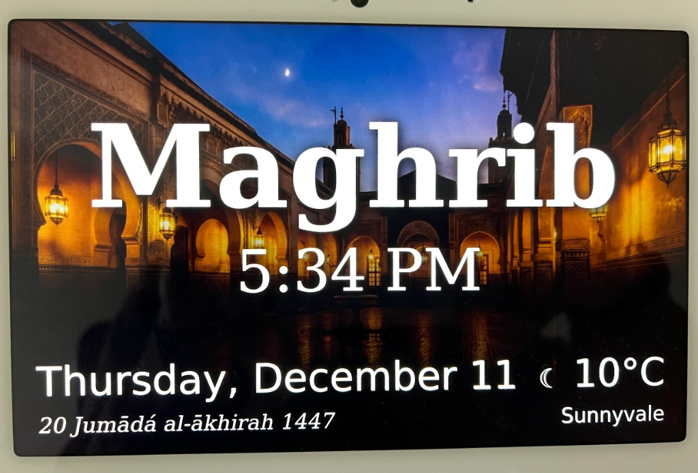
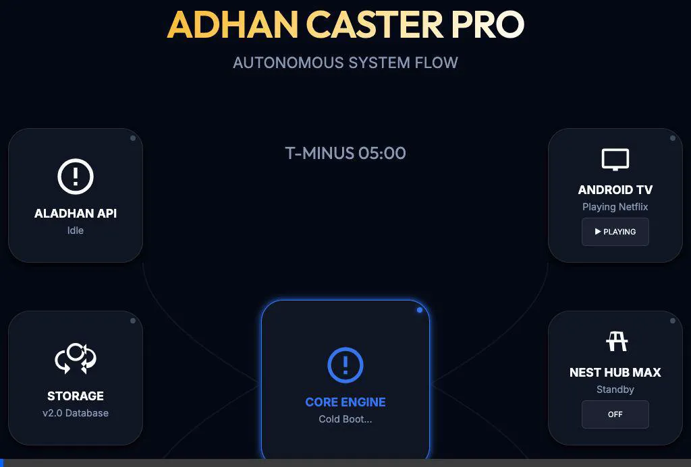

# 🕌 Adhan API & Automation System v2.0

> **Automated Adhan Caster for Google Nest Hub & Android TV**
> _Precision Prayer Times, Beautiful Visuals, and Smart Home Integration._



## 🌟 Overview

The **Adhan API** is a complete smart-home solution that automates the Muslim call to prayer (Adhan). It runs autonomously on a **Raspberry Pi**, calculating accurate prayer times, generating high-definition dashboard visuals, and casting them to Google Nest/Cast devices precisely at the right moment.

## 🔄 System Flow



It also integrates with **Android TV** via ADB to intelligently pause your media content during the Adhan and resume it afterwards.

## ✨ Key Features

### 🎯 **Precision Timing Engine**

- **Zero-Latency Playback**: Uses a smart "Pre-Flight" system that generates the video 5 minutes early and waits for the _exact millisecond_ of the prayer time to start casting.
- **Drift Correction**: Automatically corrects for generation processing time.

### 🖼️ **Dynamic Visuals (Nest Hub Max Optimized)**

- **1280x800 HD Output**: Perfectly sized for Google Nest Hub Max screens (no black bars).
- **Smart Info**: Displays current Prayer Name, Precise Time, Hijri Date, Weather (CityName), and local Temperature.
- **Context Aware**: Auto-selects backgrounds (e.g., special Eid images, Jumu'ah themes).

### 🛠️ **Robust Architecture**

- **Hybrid Status Monitoring**: A custom-built engine uses both _Passive Event Listening_ and _Serialized Active Polling_ to prevent the dreaded "Cast Device Hanging" issue.
- **Auto-Healing**: Automatically detects if ADB or the Cast device disconnects and reconnects transparently.
- **3-Strike Watchdog**: Detects if playback stops externally (e.g., voice command "Stop") and exits cleanly within seconds.

### 📺 **Smart TV Control**

- **ADB Integration**: Pauses YouTube/Netflix/TV on your Android TV Box (`<TV_IP>`) when Adhan starts.
- **Auto-Resume**: Resumes playback automatically when the Adhan finishes.

## 🏗️ Building for Production

To create a production-ready artifact for your Raspberry Pi:

1.  **Configure Local Environment**: The build script requires a local `.env` file to bundle your specific IP addresses and location settings into the production tarball.
    ```bash
    cp audio-caster/.env.example audio-caster/.env
    # Edit audio-caster/.env with your production IPs/Details
    ```

2.  **Generate Artifact**:
    ```bash
    npm run build:prod
    ```
    This creates `adhan-api-production.tar.gz`, which is ready to be transferred to your Pi.

## 🚀 Deployment (Raspberry Pi)

### Prerequisites

- Raspberry Pi 4 (or similar) running Linux.
- Node.js v18+ (installed via `nvm`).
- `ffmpeg` and `adb` installed.

### Quick Start

1.  **Clone & Install**

    ```bash
    git clone https://github.com/bilalahamad0/adhan-api.git
    cd adhan-api/audio-caster
    npm install
    ```

2.  **Configure Environment**
    Copy `.env.example` to `.env` and set your device details:

    ```env
    DEVICE_NAME="Google Display"
    TV_IP="<TV_IP>"   # Your Android TV IP
    HOST_IP="<PI_IP>" # Your Pi's IP
    ```

3.  **Start with PM2 (Production)**
    ```bash
    pm2 start boot.js --name adhan-caster
    pm2 save
    ```

### 🧪 Testing

Run a manual test to verify audio/video and casting:

```bash
node boot.js --test --debug
```

## 📂 Project Structure

| File/Folder                        | Description                                                       |
| :--------------------------------- | :---------------------------------------------------------------- |
| `audio-caster/boot.js`             | **Core Engine**. Handles timing, casting, ADB, and polling logic. |
| `audio-caster/visual_generator.js` | Generates the 1280x800 dashboard image using Canvas & OpenMeteo.  |
| `DEPLOYMENT_GUIDE_PI.md`           | Detailed step-by-step guide for Pi setup.                         |
| `images/`                          | Background assets for different prayers.                          |

## 🛡️ Stability & Security Mechanisms

| Feature                  | Function                                                                                       |
| :----------------------- | :--------------------------------------------------------------------------------------------- |
| **Leak Prevention**      | Uses serialized recursive promises instead of `setInterval` to prevent listener leaks.         |
| **Stale State Watchdog** | If device stays `PAUSED` for >3 mins, it forces a cleanup.                                     |
| **Connection Watchdog**  | If device stops responding for >20s (3 polls), it assumes disconnection.                       |
| **ADB Retry**            | Retries ADB commands once if `device offline` error is returned.                               |
| **Security Auto-Fix**    | A GitHub Action & local script that automatically detects and resolves vulnerabilities weekly. |

### 🔒 Automated Security

This repository includes an automated security workflow:

- **GitHub Action**: Runs every Monday at midnight to perform `npm audit fix` and open PRs for any required updates.
- **Local Fixer**: Run `bash scripts/fix-vulnerabilities.sh` to manually audit and fix dependencies across all sub-projects.

---

_Built with ❤️ by Bilal Ahamad_
