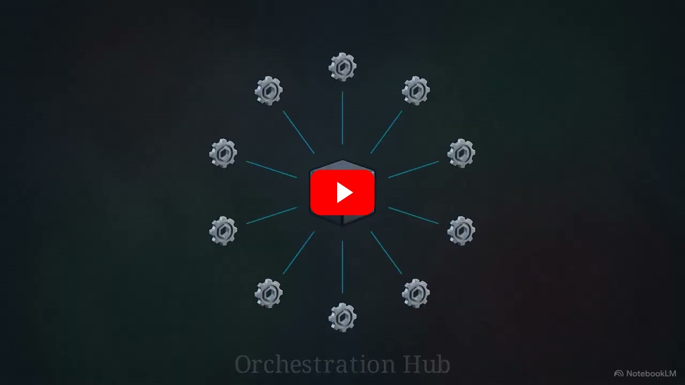
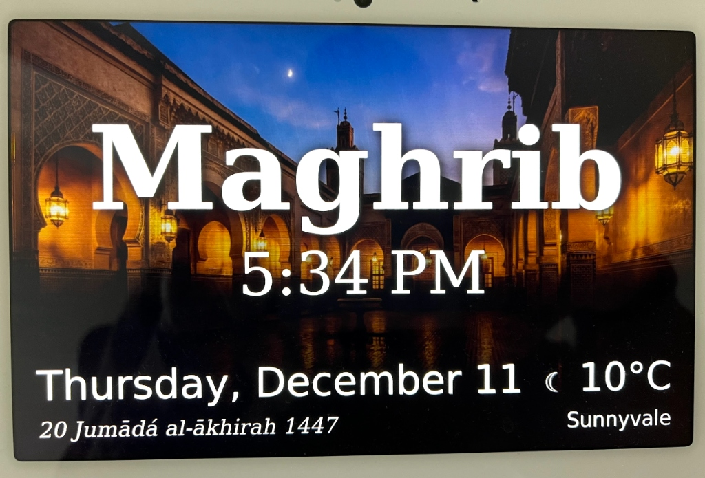
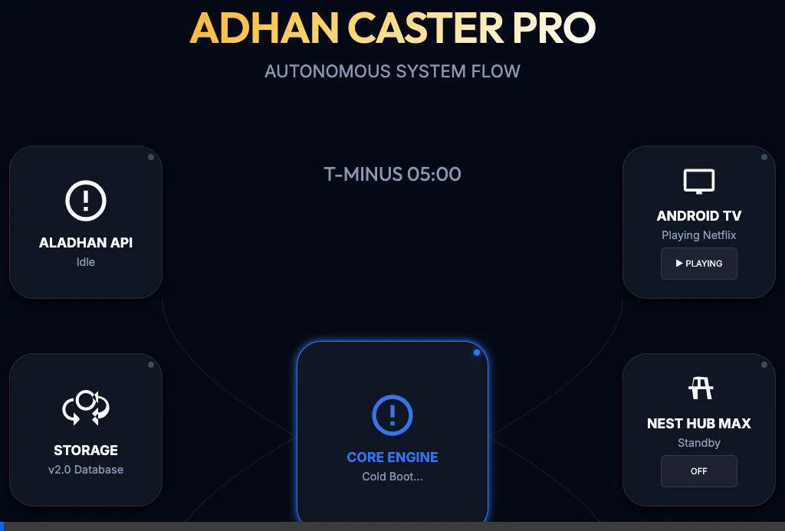
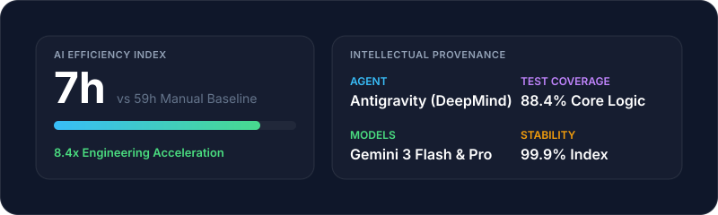

# 🕌 Adhan Media Caster: AI-Native IoT Orchestration Engine

[](https://opensource.org/licenses/MIT)
[](https://nodejs.org/)
[](https://github.com/bilalahamad0/adhan-api/commits/main)
[](https://jestjs.io/)
[](https://prettier.io/)

[](https://www.raspberrypi.com/)
[](#-deprecated-on-device-ai-layer-gemma-3--ollama)
[](https://developers.google.com/cast)
[](https://developer.android.com/tools/adb)
[](https://ffmpeg.org/)
[](https://pm2.keymetrics.io/)

> **The Invisible Conductor for the Intelligent Home Sanctuary.**
> _A masterclass in distributed I/O management, edge AI, and hardware interoperability._

### 🎬 Introductory Video: The Architecture of Automation

[](https://www.youtube.com/watch?v=GETyDnvZWog)

## 🌟 Overview

**Adhan Media Caster** is a high-performance Smart Home IoT Automation Platform that transforms standard household hardware into a precision, context-aware media ecosystem.

Developed using an **Agentic AI workflow**, the system runs on a **Raspberry Pi 4 core** that commands a complex multi-device lifecycle. It bridges the gap between digital entertainment and daily ritual by orchestrating a synchronized environment: broadcasting high-fidelity prayer audio and a live dashboard to **Google Nest Hubs** while using **ADB-level protocol injection** to intelligently manage the media state of **Sony Android TVs**.

The system previously also shipped a **local-first, on-device LLM assistant** (Gemma 3 via Ollama) that answered natural-language questions, explained failures, and advised on tuning. Ollama has since been retired from the Raspberry Pi host, and that layer has been removed from the runtime — see [Deprecated: On-Device AI Layer](#-deprecated-on-device-ai-layer-gemma-3--ollama) for the design, env vars, and endpoints, kept for reference and any future re-implementation.



---

## ✨ Key Engineering Features

> **Note:** the on-device LLM assistant (Gemma 3 via Ollama) is **deprecated and removed** from the runtime. Its design is preserved in [Deprecated: On-Device AI Layer](#-deprecated-on-device-ai-layer-gemma-3--ollama).

### 🤖 **Agentic AI Development Workflow**
This project also serves as a flagship for **AI-native hardware development**. The entire codebase was architected using an **Agentic AI workflow**, ensuring:
* **Rapid Prototyping**: Accelerating the bridge between low-level ADB commands and high-level Cast protocols.
* **Edge-Case Resilience**: AI-driven stress testing of "Cast Device Hanging" and network latency scenarios.

### 🎯 **Precision Deterministic Timing**
- **Zero-Latency Orchestration**: Features a "Pre-Flight" engine that renders dynamic visuals 5 minutes early, then holds the payload in a ready-state to trigger at the *exact millisecond* of the prayer time.
- **Adaptive Cast Lead**: Learns from a rolling history of cast-connect latencies (p75) to fire just early enough — compensating for processing overhead and network jitter.

### 📺 **Advanced Media & Power Management**
- **Composite "Ghost Power" Detection**: Solves the "Network Zombie" problem common in smart TVs. The system uses a multi-stage verification (Ping + ADB `dumpsys power`) to detect physical standby states even when the network interface remains active, transitioning to `SLEEPING` mode within 120 seconds to preserve resources.
- **ADB Protocol Injection**: Moves beyond simple "On/Off" commands. The system performs deep state-inspection of the Android TV, intelligently pausing active streams (Netflix/YouTube) and resuming them with zero user intervention post-broadcast.
- **Procedural Weather Engine**: Implements a high-fidelity rendering pipeline using FFmpeg `lut2` luminance-addition. Generates high-density, cinematic atmospheric effects (Rain, Snow, Fog) directly on top of mosque wallpapers with zero color-tinting and perfect channel fidelity.
- **Context-Aware Visuals**: Generates 1280x800 HD dashboards (optimized for Nest Hub Max) with real-time weather integration, the Islamic **Hijri calendar date**, and dynamic theme switching.

### 🛡️ **Industrial-Grade Reliability**
- **Hybrid Status Monitoring**: Implements a dual-layer watchdog using **Passive Event Listening** and **Serialized Active Polling** to mitigate the common "ghosting" issues found in standard Cast implementations.
- **Self-Healing Infrastructure**: Automated detection and transparent reconnection for ADB and Cast sessions.
- **Adaptive FFmpeg Pipeline**: Automatically detects system binary paths and hardware limitations to deliver optimized video "baking" in under 10 seconds.
- **Leak-Proof Concurrency**: Replaced traditional `setInterval` with **serialized recursive promises** to prevent memory leaks and listener exhaustion in long-running processes.

---

## 🛠️ Tech Stack & Engineering Mastery

| Layer | Technologies |
| :--- | :--- |
| **Core Logic** | Node.js (v18+), Asynchronous Event-Loop Architecture |
| **Edge AI** _(retired)_ | Gemma 3 (1B) via Ollama — local inference, off the cast path. Removed from the runtime; see [Deprecated](#-deprecated-on-device-ai-layer-gemma-3--ollama) |
| **Hardware** | Raspberry Pi 4, Sony Android TV, Google Nest Hub Max |
| **Protocols** | mDNS/Castv2 (Google Cast), ADB (Android Debug Bridge) |
| **API / Server** | Express 5, REST control + metrics endpoints |
| **Media Engine** | FFmpeg, Canvas API (Dynamic HD Rendering) |
| **Data & Dashboard** | Firebase Admin / Firestore, Open-Meteo API |
| **Infrastructure** | PM2 Process Management, GitHub Actions |
| **Quality** | Jest, ESLint, Prettier |

---

## 🔄 System Flow



> **[🎛️ Open the Interactive Architecture & System Design ↗](https://bilalahamad0.github.io/adhan-api/architecture.html)**
> — a single-page, animated walkthrough of the **layered architecture**, the **data/control-flow map**, the **live prayer-cast lifecycle**, and the on-device AI **quiet-window fence**. ([source](./architecture.html))

## 📊 Development Analytics

This project features a **Live AI-Driven Engineering Dashboard** that tracks development metrics, AI utilization, and system health in real-time.

[](https://bilalahamad0.github.io/adhan-api/dashboard.html)

> **[Open Interactive Dashboard (Live Sync) ↗](https://bilalahamad0.github.io/adhan-api/dashboard.html)**

---

## 🏗️ Deployment & Production Scaling

### 1. Artifact Generation
To bundle a production-ready artifact for the Raspberry Pi environment:
```bash
# 1. Initialize environment
cp media-caster/.env.example media-caster/.env

# 2. Build production tarball
npm run build:prod
```

### 2. Raspberry Pi Implementation
```bash
# Clone and initialize
git clone https://github.com/bilalahamad0/adhan-api.git
cd adhan-api/media-caster
npm install

# Deploy with PM2 for high availability
pm2 start boot.js --name adhan-caster
pm2 save
```

After you change any `media-caster` files on the Pi (`git pull`, tarball, or copy), **restart the process** or Node will still be running the old code:

```bash
pm2 restart adhan-caster --update-env
```

Then, if you rely on the [Operations Dashboard](https://bilalahamad0.github.io/adhan-api/dashboard.html) and Firestore metrics, trigger a sync from the Pi: `curl -sS -X POST "http://localhost:3001/api/metrics/sync"` (expect `"prayersScheduled":5` when the schedule file is current). See [DEPLOYMENT_GUIDE_PI.md](./DEPLOYMENT_GUIDE_PI.md) for full detail.

---

## 🌐 REST API

`boot.js` exposes a local control + telemetry API (default port `3001`, override with `SERVER_PORT`):

| Method & Path | Purpose |
| :--- | :--- |
| `GET /health` | Liveness probe + deployed build version / short SHA. |
| `GET /api/metrics?days=N` | Rolling multi-day playback summary (success rate, latency, streaks). |
| `GET /api/metrics/today` | Today's playback summary. |
| `POST /api/trigger/prayer` | Manually fire a prayer cast (`fajr`…`isha`) — useful for testing. |
| `POST /api/metrics/sync` | Push today's metrics + schedule to Firestore for the dashboard. |

---

## 🧪 Testing & Quality

A **Jest** suite covers the scheduler, media/hardware services, Firestore sync, and the visual generator.

```bash
npm test            # full Jest suite
npm run test:cov    # with coverage
npm run lint        # ESLint
npm run format      # Prettier
```

Verify the hardware handshake and media-state logic on real devices before deployment:

```bash
node media-caster/boot.js --test --debug   # live system test
npm run test:smoke                          # fast smoke check
npm run qa:sanity                           # config + schedule sanity
```

---

## 🏛️ System Architecture

| Module | Functional Responsibility |
| :--- | :--- |
| `media-caster/boot.js` | **Orchestration Core + REST API**. Wires services, exposes `/api/*`, and starts the scheduler. |
| `media-caster/services/CoreScheduler.js` | **Authoritative scheduler & player** — prayer timing, pre-flight rendering, cast lifecycle, and retries. |
| `media-caster/services/MediaService.js` | Audio cache, Adhan source selection, and fallback mirrors. |
| `media-caster/services/HardwareService.js` | ADB control of the Android TV (pause/resume, ghost-power detection). |
| `media-caster/services/DiscoveryService.js` | mDNS discovery of Google Cast / Nest devices. |
| `media-caster/services/PlaybackLogger.js` | Durable event log + rolling metrics (success rate, latency, adaptive lead). |
| `media-caster/services/FirestoreSync.js` | Pushes metrics + schedule to Firestore for the operations dashboard. |
| `media-caster/visual_generator.js` | **Rendering engine** — builds HD dashboards and procedural weather via Canvas/FFmpeg. |

---

## 🛡️ Automated Maintenance & Security

The platform is designed for "Set-and-Forget" reliability:
| Feature | Description |
| :--- | :--- |
| **Leak-Proof Concurrency** | Replaced `setInterval` with **serialized recursive promises** to prevent memory leaks in long-running processes. |
| **Stale State Watchdog** | If a device remains `PAUSED` for >3 minutes, the system forces a cleanup to prevent "stuck" states. |
| **Connection Watchdog** | If a device fails 3 consecutive polls, it is assumed disconnected, and the system attempts a hard reset. |
| **ADB Retry Logic** | Automatically retries ADB commands once upon detecting `device offline` errors. |
| **Automated Security** | Weekly `npm audit fix` via GitHub Actions and a local fixer script to maintain dependency hygiene. |

---

## 📱 Companion App

**[Adhan Caster (Chrome Extension) ↗](https://github.com/bilalahamad0/adhan-ce)** — a browser companion that shows upcoming prayer times with a live countdown and auto-pauses media in every tab at Adhan time. (Previously bundled here; now maintained in its own repository.)

---

## 🪦 Deprecated: On-Device AI Layer (Gemma 3 + Ollama)

> **Status: removed from the runtime.** Ollama was uninstalled from the Raspberry Pi host in August 2026, which made the integration permanently dead code. The implementation (service class, REST endpoints, dashboard assistant card, and scheduled jobs) has been deleted. This section is retained deliberately so the design is not lost and a future re-implementation has a starting point.

**What it was.** A fully on-device LLM — **Gemma 3 (1B)** served by **[Ollama](https://ollama.com/)** on `127.0.0.1:11434` — that answered natural-language questions about the schedule, explained cast failures in plain English, wrote a daily dashboard greeting, and proposed (never applied) env-var tuning. No cloud, no API keys, no data leaving the network.

**The AI fence.** Inference was architecturally forbidden inside each prayer's critical window (5 minutes before → 8 minutes after). A Pi 4 takes ~5–10 s per inference and the cast fires ~2 s before prayer, so every AI code path was gated behind a quiet-window guard and none of it could delay the Adhan.

**Removed modules**

| Module | Responsibility |
| :--- | :--- |
| `media-caster/services/OllamaService.js` | Ollama client — single-flight queue, hard timeouts, JSON-fence-stripping parser, health check, quiet-window guard, circuit breaker + watchdog, model warm-up. |
| `media-caster/services/AdvisoryAgent.js` | Off-path intelligence — failure diagnosis, cached daily blurb, 14-day tuning advisory, persistent `ai-memory.json` / `ai-blurb.json`. |
| `media-caster/services/aiContext.js` | Deterministic grounding context (next prayer, per-prayer countdowns, today's playback) so the 1B model never invented times. |
| `media-caster/tests/OllamaService.test.js` | Circuit-breaker, quiet-window, JSON-parse, and grounding-context coverage. |

**Removed endpoints**

| Method & Path | Purpose |
| :--- | :--- |
| `POST /api/ask` | Natural-language status query (Gemma, with a computed deterministic fallback so it never hard-failed). |
| `GET /api/ask/health` | Whether the local model was reachable; the dashboard used it to reveal the assistant card. |
| `GET /api/blurb` | Cached daily dashboard greeting. |
| `GET /api/advisory` | Latest advisory-only tuning suggestions. |

**Removed dashboard UI.** `dashboard.html` carried an `#ai-assistant-card` (blurb, question input, answer pane) that stayed hidden unless `/api/ask/health` reported the daemon reachable, plus an API-base resolver (`?api=` query param, remembered in `localStorage` under `adhanApiBase`) for reaching the Pi over a VPN.

**Environment variables (no longer read)**

| Variable | Default | Purpose |
| :--- | :--- | :--- |
| `OLLAMA_URL` | `http://127.0.0.1:11434` | Base URL of the local Ollama daemon. |
| `OLLAMA_MODEL` | `gemma3-constrained` | Resource-capped model built from a `Modelfile` on top of `gemma3:1b`. |
| `OLLAMA_RESTART_CMD` | `sudo systemctl restart ollama` (Linux) | Watchdog restart command issued when the circuit breaker tripped. |

**To re-enable it in future**, install Ollama on the Pi and rebuild the resource-capped model, then restore the modules above:

```bash
ollama pull gemma3:1b
ollama create gemma3-constrained -f ./Modelfile   # Modelfile detailed in the whitepaper
```

The full rationale, Modelfile, prompts, and benchmark numbers live in the [Edge AI Whitepaper](./docs/blog/gemma-ollama-raspberry-pi-adhan.md).

---

## 📚 Documentation

- [DEPLOYMENT_GUIDE_PI.md](./DEPLOYMENT_GUIDE_PI.md) — Comprehensive Raspberry Pi setup guide.
- [PROJECT_PLAN.md](./PROJECT_PLAN.md) — Original design, architecture evolution, and what's been retired.
- [Edge AI Whitepaper: Gemma 3 + Ollama](./docs/blog/gemma-ollama-raspberry-pi-adhan.md) — Deep dive into the on-device AI layer (**historical** — the layer is [deprecated](#-deprecated-on-device-ai-layer-gemma-3--ollama)).
- [architecture.html](./architecture.html) — Interactive, animated architecture · system design · prayer-cast workflow ([live ↗](https://bilalahamad0.github.io/adhan-api/architecture.html)).

---

Designed & Engineered by Bilal Ahamad
