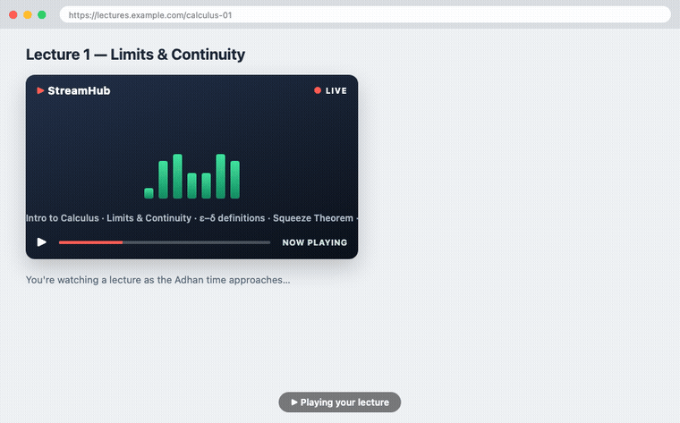

# Adhan Caster Pro — Chrome Extension

A companion browser extension for the Adhan Media Caster. It shows a live
countdown to the next prayer and, at Adhan time, **pauses media in every Chrome
tab** — the browser equivalent of the Pi's "pause the TV during Adhan" behavior.

It is a fully standalone, additive component: it talks only to the existing
public prayer-times API and does not touch the Pi cast/scheduler code.

## Features

- **Next-prayer popup** — all five daily prayers with the next one highlighted and a live countdown.
- **In-page heads-up countdown** — a card pinned to the bottom-right of whatever tab you're looking at, appearing before the prayer (default **30s**, configurable 15/30/60) and counting down per second. No Resume button here, so it never competes with the focus screen that takes over.
- **Auto-pause across tabs** — at the exact prayer time, every playing `<video>`/`<audio>` (including same-/cross-origin iframes) is paused.
- **Resume** — one **Resume** button (popup or the in-page card) restores the tabs that were paused, and playback **auto-resumes** after a configurable delay (default 5 min).
- **Prayer focus mode** (opt-in) — a full-screen, dismissible focus screen across tabs during the Adhan. Enable it by default in settings, or trigger it per-event from the notification's **Prayer focus** button or the popup. Exit anytime with **Resume** or **Esc**; it auto-lifts with the resume timer. No extra permissions.
- **Desktop notification** at prayer time, with **Prayer focus** / **Resume now** action buttons.
- **Keyboard shortcut** — `Ctrl/Cmd+Shift+Y` toggles the focus screen on/off during an active Adhan (rebind at `chrome://extensions/shortcuts`).
- **Location preference** — set your city, **state/province**, and country in the popup (state disambiguates places like Sunnyvale CA vs. TX); the schedule reloads from the API.

## Load it (unpacked)

1. Open `chrome://extensions` in Chrome.
2. Toggle **Developer mode** on (top-right).
3. Click **Load unpacked** and select this `chrome-extension/` folder.
4. Pin the extension and click its icon. Open the **⚙ settings** to set your city/country, then **Save**.

> First load asks for broad site access ("read and change all your data on all websites").
> That permission is what lets the extension reach into any tab to pause media — the core feature.

## Dev demo — see it without waiting for a prayer

1. Open a tab playing media (e.g., a YouTube video) and start it.
2. Click the extension icon → **⚙ settings** → **Run test Adhan (30s)**. _(This button only appears in unpacked/dev builds — it's hidden in the published version.)_
3. Switch to the media tab. A countdown appears bottom-right and ticks down; at zero the media **pauses**, the desktop notification fires, and (if focus mode is on, or you press the notification's **Prayer focus**) the **focus screen** takes over. It auto-resumes after your configured delay, or press **Resume** / **Esc**.

The test reuses the real pipeline (alarm → broadcast → content scripts) and then restores the real schedule, so it's a faithful preview. It's ~30s because `chrome.alarms` clamps shorter delays. Requires **Enable Adhan Caster** on, and the OS must allow notifications for Chrome (e.g. macOS **System Settings → Notifications → Google Chrome**) for the desktop banner to appear.

> Regenerate the demo above with `bash docs/make-demo.sh` (headless Chrome + ffmpeg).

## Testing

Run `npm run test:ext` (unit + manifest qualification) and `npm run pack:ext` (qualify-then-zip). See [docs/TESTING.md](docs/TESTING.md) for the full pre-publish checklist.

## How it works

| Piece | Responsibility |
| :--- | :--- |
| `background.js` (service worker) | Fetches the schedule from `adhan-api-mauve.vercel.app/api/prayerTimes`, parses the 5 prayer times into today's timestamps, arms `chrome.alarms`, fires the desktop notification + broadcasts the pause at prayer time, and arms auto-resume. |
| `content.js` (all frames) | Per-second ticker that renders the bottom-right countdown overlay in the top visible frame, and pauses/resumes its own frame's media. Uses a Shadow DOM so page CSS can't interfere. |
| `popup.html/js/css` | Prayer list, live countdown, Resume button, and the location/auto-resume settings. |
| `icons/generate-icons.cjs` | Regenerates the PNG icons (no dependencies — pure Node `zlib`). Run `node icons/generate-icons.cjs`. |

### Notes & assumptions

- The API returns prayer times as `"hh:mm a"` strings (no timezone). They are parsed in the **browser's local timezone**, which is correct when your machine's timezone matches the configured location (the project default is `America/Los_Angeles`).
- `chrome.alarms` is not second-accurate when the service worker is asleep, so `content.js` also self-triggers the pause the moment its own countdown reaches zero. Both paths are idempotent.
- Restricted pages (`chrome://`, the Web Store, the PDF viewer) can't host content scripts, so media there isn't paused — this is a Chrome platform limitation.
